# Journal TP1 - Déploiement de todo-api

**Date :** 6 mai 2026
**Auteur :** Amr
**Dépôt GitHub :** https://github.com/Amr69130/tp-deploiement

---

## 🛠️ Étapes de réalisation

### 1. Configuration du serveur Ubuntu (VM)

- [x] Mise à jour du système et installation des outils
- [x] Configuration UFW : SSH (22), HTTP (80), HTTPS (443)
- [x] Création de l'utilisateur applicatif `todoapp`
- [x] Installation de Node.js 20 LTS et des outils de compilation

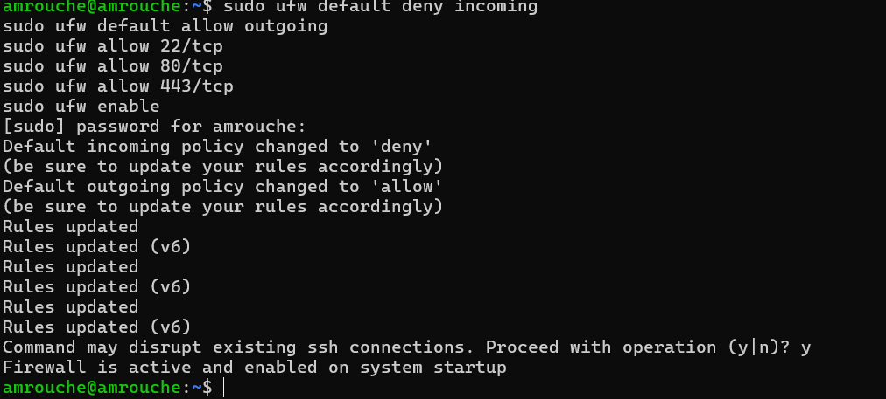
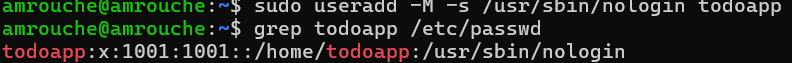
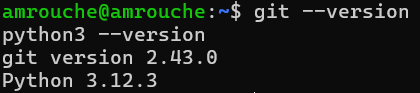

### 2. Déploiement de l'application

- [x] Création des répertoires /opt/todo-api, /var/lib/todo-api, /var/log/todo-api
- [x] Clonage du dépôt Git et gestion des permissions
- [x] Installation des dépendances de production (npm ci)

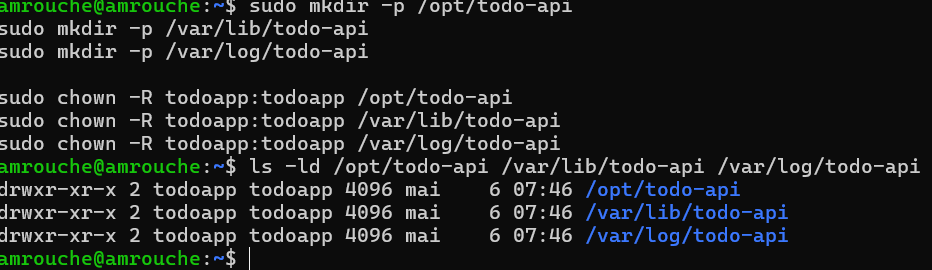
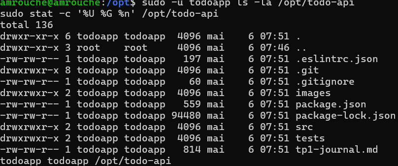
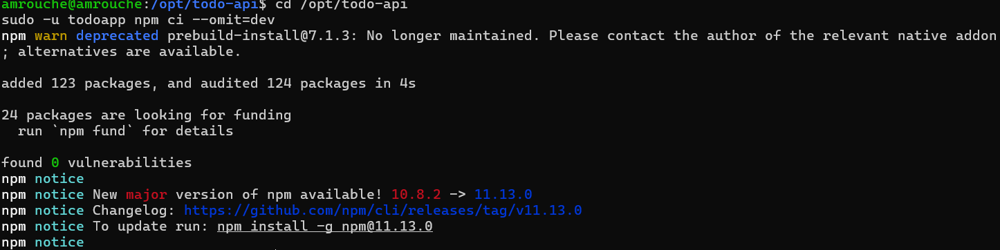

### 3. Configuration et Initialisation

- [x] Création et sécurisation du fichier .env
- [x] Initialisation de la base de données SQLite
- [x] Tests manuels des routes via curl

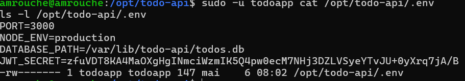
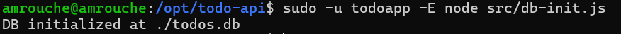
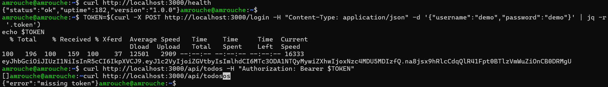

### 4. Mise en production avec Systemd

- [x] Création du service todo-api.service
- [x] Activation et vérification du statut
- [x] Test de résilience (Auto-restart après kill -9)

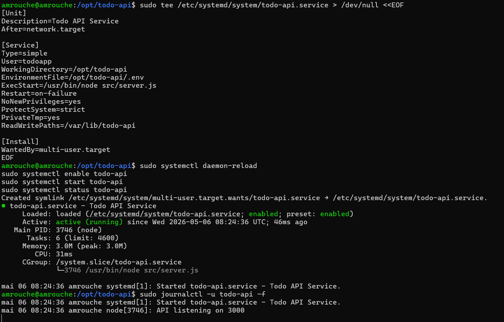
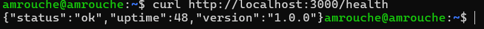
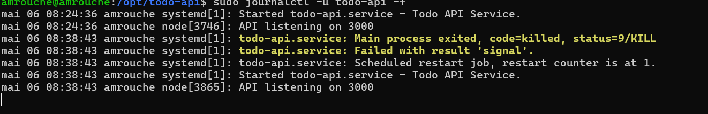

### 5. Configuration du Reverse Proxy Nginx

- [x] Installation et configuration du bloc serveur
- [x] Test de la syntaxe et rechargement
- [x] Validation de l'accès extérieur via l'IP publique

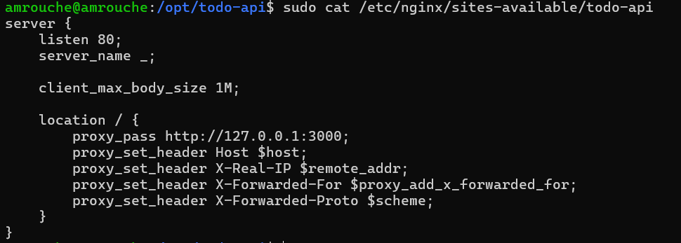
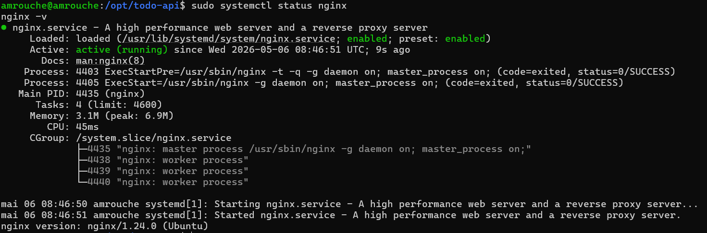
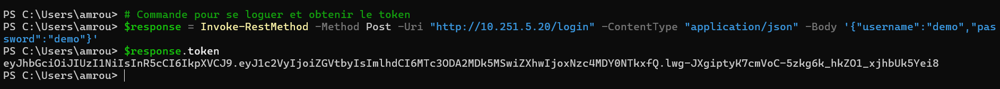

### 6. Validation finale (Tests CRUD)

- [x] Authentification et génération du Token JWT
- [x] Cycle de vie d'une tâche : Création, Lecture, Modification, Suppression

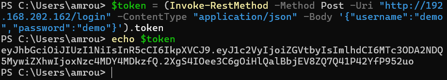
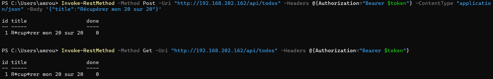
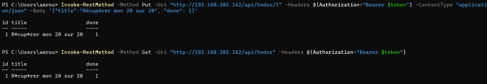
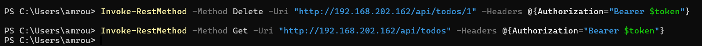

---

## 📘 Runbook (Guide d'exploitation)

### 1. Gestion du service

- **Redémarrer :** `sudo systemctl restart todo-api`
- **Logs en temps réel :** `sudo journalctl -u todo-api -f`

### 2. Déploiement et Rollback

- **Mise à jour :**
  1. `cd /opt/todo-api && sudo -u todoapp git pull`
  2. `sudo -u todoapp npm ci --omit=dev`
  3. `sudo systemctl restart todo-api`
- **Rollback :**
  1. `sudo -u todoapp git checkout <commit_hash>`
  2. `sudo systemctl restart todo-api`

### 3. Sécurité (JWT)

- **Changement de clé :** Modifier `JWT_SECRET` dans `/opt/todo-api/.env` et redémarrer le service.
- **Conséquence :** Invalide instantanément tous les jetons en circulation.

### 4. Dépannage

- **Erreur 502 Bad Gateway :** Vérifier que le service Node tourne (`systemctl status todo-api`).
- **Erreur Nginx :** Tester la configuration avec `sudo nginx -t`.
