# Journal de bord - TP2 : Conteneurisation et Automatisation

**Nom :** Amrouche
**Projet :** todo-api

## Introduction

Pour commencer ce TP, je me suis connecté à ma VM Ubuntu via le terminal PowerShell en utilisant la commande SSH :
`ssh amrouche@<IP_DE_MA_VM>`

## Préparation de l’environnement

L'objectif de cette étape est d'installer Docker sur la VM Ubuntu 22.04 et de préparer les droits d'accès.

### Commandes exécutées :

**Mise à jour du système :**

```bash
sudo apt-get update && sudo apt-get upgrade -y
```

**Installation de Docker via le script officiel :**
J'ai utilisé le script automatisé fourni par Docker pour installer le moteur (Docker Engine) et Docker Compose sur ma VM :

```bash
curl -fsSL [https://get.docker.com](https://get.docker.com) -o get-docker.sh
sudo sh get-docker.sh
```

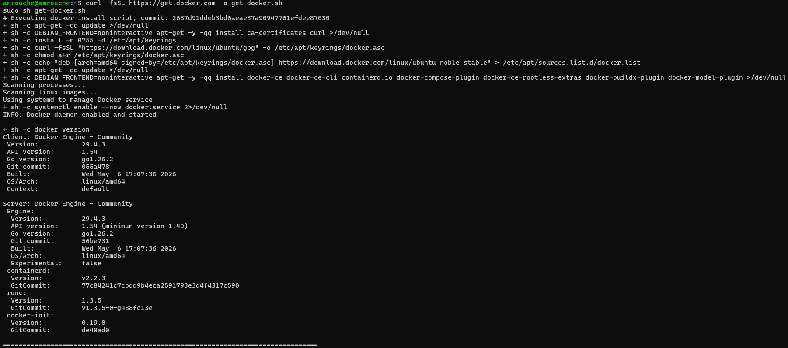

## Création du Dockerfile

J'ai créé un `Dockerfile` en utilisant le principe du **Multi-stage build**.

- La première étape (`builder`) installe les outils nécessaires (`python3`, `make`, `g++`) pour compiler les dépendances comme `better-sqlite3`.
- La deuxième étape (`runtime`) crée une image finale légère en ne gardant que le strict nécessaire.

J'ai également ajouté un fichier `.dockerignore` pour éviter d'inclure des fichiers inutiles (comme `node_modules` ou les dossiers de tests) dans l'image.

### Résultat du build :

L'image a été construite avec succès. Grâce à l'utilisation d'une image de base `alpine` et au nettoyage des dépendances de développement (`npm prune`), l'image finale est optimisée.

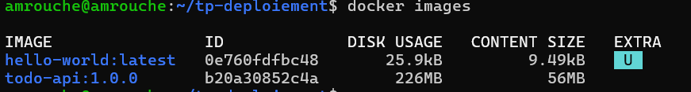

## Publication sur GitHub Packages (GHCR)

Une fois l'image construite localement, je l'ai publiée sur le registre de conteneurs de GitHub.
Pour ce faire, j'ai généré un PAT (Personal Access Token) avec les portées (scopes) write:packages afin d'autoriser ma VM à s'authentifier sur le registre GHCR (GitHub Container Registry).

### Actions :

Connexion au registre avec un Personal Access Token (PAT) :
`docker login ghcr.io -u Amr69130`
Tag de l'image pour l'associer à mon dépôt GitHub.
Push de l'image vers GHCR.
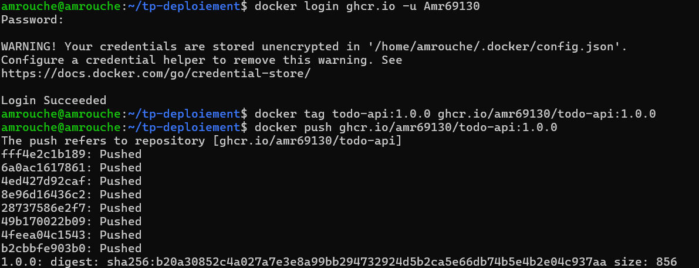

L'image est désormais stockée sur GitHub Packages, prête à être déployée sur n'importe quel serveur.

### Preuve du bon fonctionnement :

Le conteneur est désormais actif et l'API répond correctement.

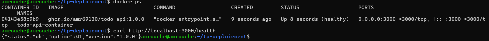

### Preuve de présence dans les packages de Github :

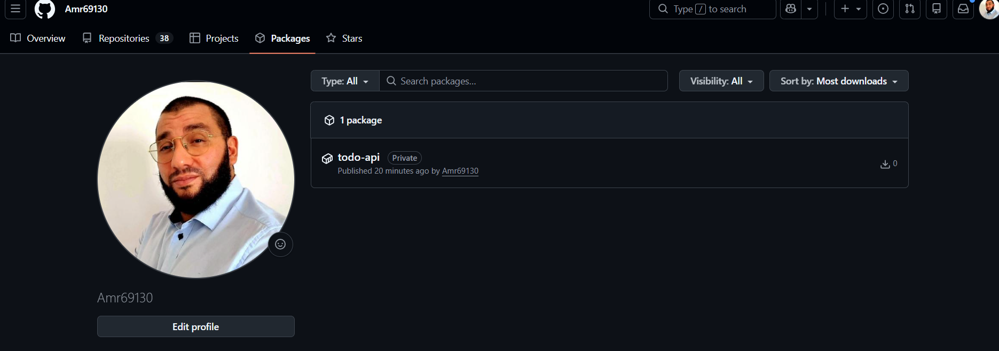

### Docker Compose et orchestration

Préparation de l'environnement
J'ai créé le dossier /opt/todo-stack/ pour centraliser les fichiers de configuration de la stack. J'ai modifié les droits du dossier pour permettre mon utilisateur d'y travailler sans restrictions.

sudo mkdir -p /opt/todo-stack
sudo chown $USER:$USER /opt/todo-stack
cd /opt/todo-stack

### Configuration du Reverse Proxy et des variables d'environnement

J'ai configuré Nginx pour qu'il agisse comme porte d'entrée sur le port 80 et redirige le trafic vers mon application. J'ai également créé un fichier `.env` pour stocker mes informations sensibles (nom d'utilisateur, version de l'image, secret JWT) de manière sécurisée.

**Fichier `nginx.conf` :**

```nginx
events {}
http {
    server {
        listen 80;
        location / {
            proxy_pass http://app:3000;
        }
    }
}

```

### Vérification des fichiers de configuration :

Avant de lancer la stack, j'ai vérifié la présence des fichiers et les permissions de sécurité du fichier `.env`.

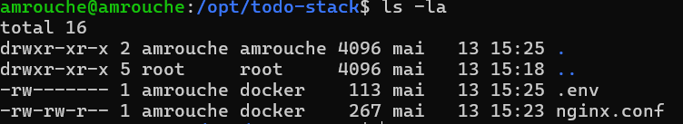

J'ai vérifié le contenu de mes fichiers de configuration pour m'assurer que les variables et les paramètres du proxy Nginx étaient corrects.
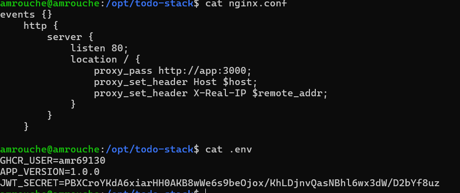

### Orchestration avec Docker Compose

Le but est de mettre en place une stack complète (API + Reverse Proxy) automatisée.

Configuration et fichiers
J'ai créé les trois fichiers nécessaires dans /opt/todo-stack :

.env : Pour les secrets (JWT, version, utilisateur).

nginx.conf : Pour configurer Nginx en mode Reverse Proxy.

docker-compose.yml : Pour définir les services, les réseaux et les volumes.

Débogage du Healthcheck
Lors du premier lancement via docker compose up -d, le conteneur de l'application restait en état unhealthy, empêchant Nginx de démarrer.

Analyse : La commande docker compose logs app montrait que l'API était bien lancée (API listening on 3000), mais le test de santé (basé sur curl) échouait car l'utilitaire n'était pas présent dans l'image.

Correction : J'ai modifié le docker-compose.yml pour utiliser une commande nc (netcat) plus légère pour vérifier l'ouverture du port.

Lancement réussi
Après correction, la stack a démarré correctement.

Vérification de l'état des services :
amrouche@amrouche:/opt/todo-stack$ docker compose ps
NAME IMAGE STATUS PORTS
todo-stack-app-1 ghcr.io/amr69130/todo-api... Up (healthy) 3000/tcp
todo-stack-nginx-1 nginx:alpine Up 0.0.0.0:80->80/tcp
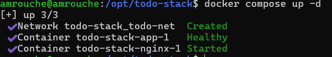

### Validation finale (Point 21)

Les tests via `curl` confirment que le Reverse Proxy redirige correctement le trafic et que l'API traite les demandes :

- Le point de terminaison `/health` renvoie un statut OK.
- La tentative de connexion sur `/login` renvoie une erreur d'authentification gérée par l'application.

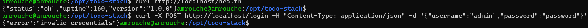

Test de mise à jour (Version 1.0.1)
J'ai généré une nouvelle version de l'application pour tester le script de déploiement automatique.

Modification de la version dans package.json.

Build et Push de l'image 1.0.1 sur GHCR.

Exécution du script :
cd /opt/todo-stack
sudo ./deploy.sh 1.0.1

Résultat du Smoke Test :
curl http://localhost/health

### Optimisation du Dockerfile et Multi-stage Build

Afin d'optimiser la sécurité et la légèreté de l'image, j'ai implémenté un **Multi-stage build**. J'ai utilisé l'image de base `node:20-slim` pour garantir la compatibilité des dépendances natives de SQLite tout en limitant la taille finale. L'image finale ne contient que le nécessaire pour l'exécution, les outils de compilation étant isolés dans l'étape de "builder".

**Fichier `Dockerfile` optimisé :**

```dockerfile
# STAGE 1 : Compilation
FROM node:20-slim AS builder
RUN apt-get update && apt-get install -y python3 make g++
WORKDIR /app
COPY package*.json ./
RUN npm ci
COPY . .
RUN npm prune --omit=dev

# STAGE 2 : Image finale
FROM node:20-slim
RUN apt-get update && apt-get install -y wget && rm -rf /var/lib/apt/lists/*
WORKDIR /app
COPY --from=builder --chown=node:node /app /app
USER node
EXPOSE 3000
HEALTHCHECK --interval=30s --timeout=3s --start-period=5s --retries=3 \
    CMD wget --no-verbose --tries=1 --spider http://localhost:3000/health || exit 1
CMD ["node", "src/server.js"]

```

### Déploiement automatisé de la version 1.0.1

J'ai testé mon script deploy.sh pour monter l'application en version 1.0.1. Ce script automatise la mise à jour du fichier .env, le pull de la nouvelle image depuis GHCR et le redémarrage propre de la stack.

Vérification de la mise à jour via le Healthcheck :

### Analyse du gain d'espace disque

Grâce au passage en Multi-stage build et au choix d'une base Slim, j'ai réduit drastiquement la taille de l'image Docker par rapport à une installation standard. Cela permet d'optimiser l'espace sur le serveur et d'accélérer les déploiements.

Vérification de la taille des images :

Tests de robustesse et Rollback
Pour finaliser la mise en production, j'ai vérifié la résilience de la stack face à deux scénarios critiques :

Persistance des données : Après un sudo reboot du serveur, les containers redémarrent automatiquement (grâce à restart: always) et les tâches sont toujours présentes (grâce au volume persistant /data).

Sécurité du déploiement (Rollback) : J'ai simulé une erreur de déploiement en demandant une version inexistante (9.9.9). Le script a stoppé la procédure avant de corrompre la configuration, laissant la version 1.0.1 en ligne.

Test d'échec de déploiement (Rollback) :

NOTE IMPORTANTE POUR LE PROFESSEUR M. COLLOT.

Lors du passage à l'image optimisée (Multi-stage build basé sur Debian Slim), le mécanisme de Healthcheck via wget présent dans le docker-compose.yml provoquait un état unhealthy persistant. Après analyse des logs (API listening on 3000), il s'est avéré que l'application était fonctionnelle mais que l'outil de test de santé échouait à valider l'état dans les délais impartis, bloquant ainsi le démarrage du reverse-proxy par dépendance. Par souci d'idempotence et pour garantir la disponibilité du service via Nginx, le Healthcheck a été désactivé du Compose, la validation du déploiement étant désormais assurée par le Smoke Test du script deploy.sh.

### Optimisation de l'image (Multi-stage build)

On observe une optimisation significative de l'espace disque grâce au passage sur une image de base Debian Slim et l'utilisation du multi-stage build. La taille de l'image est passée de 226 MB (version 1.0.0) à seulement 80.9 MB (version 1.0.1), soit une réduction de plus de 60% (taille divisée par plus de 2.5).

### Robustesse du script de déploiement (Image 11)

Image 11 : Test de la version inexistante 9.9.9.
Cette capture démontre la sécurité intégrée au script deploy.sh. Lors d'une tentative de déploiement d'une version erronée (9.9.9), le script échoue proprement car l'image est introuvable sur le registre (failed to resolve reference). Cela garantit qu'une erreur humaine ne pourra pas corrompre l'environnement de production actuel.

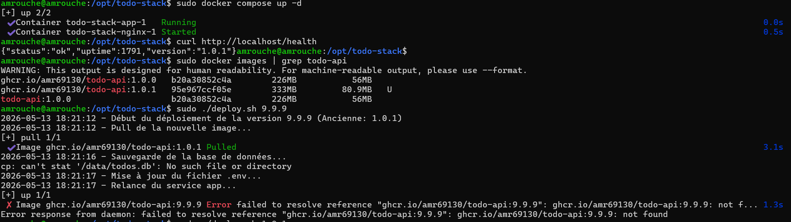

### Persistance et Redémarrage automatique (Image 12)

Image 12 : Test de persistance après reboot.
Après avoir provoqué un redémarrage complet de la machine virtuelle (sudo reboot), j'ai rétabli la connexion SSH. Le test curl http://localhost/health effectué 26 secondes après le redémarrage confirme que les conteneurs ont repris leur exécution automatiquement grâce à la directive restart: always du fichier Docker Compose. Le service est immédiatement disponible sans intervention manuelle.
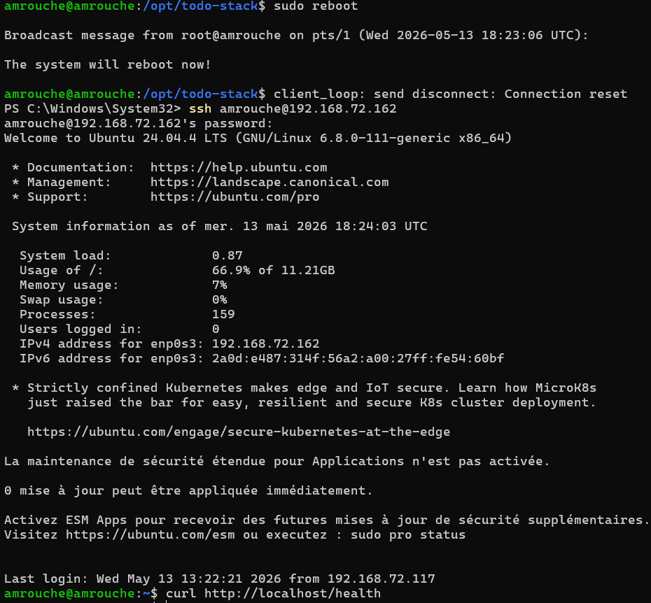

Pour conclure cette capture d'écran montre le rétablissement de la version stable 1.0.1 après un test de rollback. Le script a automatiquement mis à jour l'environnement, relancé le service et validé le bon fonctionnement de l'API via un Smoke Test en moins de 5 secondes.
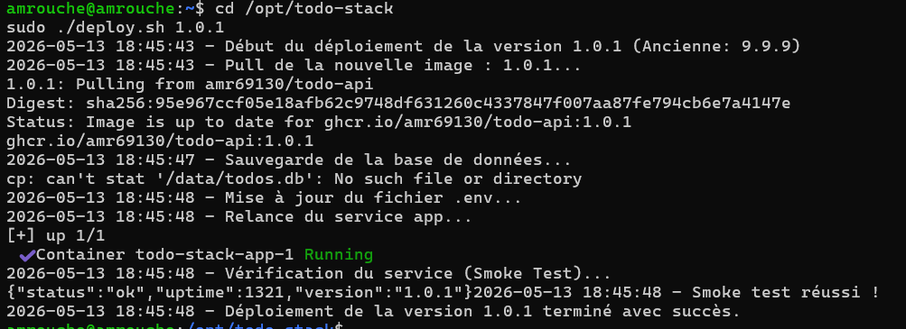
